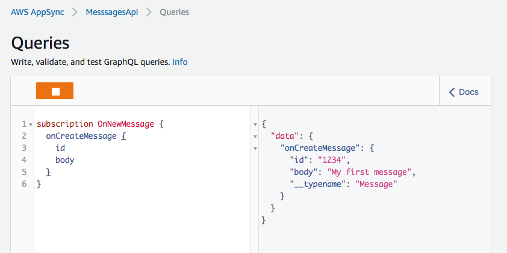

# aws-appsync-external-mutation

aws-appsync-external-mutation is a sample project that demonstrates how to publish updates to subscribers when data in a data source is mutated external to AppSync itself. AppSync does not currently support listening to changes in the underlying data source, thus following the pattern described here can be useful when your application needs to keep clients up-to-date even when the data is mutated outside of AppSync.

For example, consider a chat application in which users can send each other messages, but so too can systems (e.g. web hook or build server). Instead of interacting with AppSync's GraphQL endpoint, the system may interact directly with the data source or via another API. When the system creates a messsage, outside of AppSync, chat subscribers would not be updated without implementing a system that captures the new message and mutates the data within AppSync. This project demonstrates this pattern using DynamoDB as a data source.

In this sample, we rely on Amazon DynamoDB Streams to trigger an AWS Lambda function when new messages are inserted into the table. The Lambda function then executes a mutation via the GraphQL endpoint, passing the details of the new messsage. That mutation is tied to a [Local Resolver](https://docs.aws.amazon.com/appsync/latest/devguide/tutorial-local-resolvers.html) that will not update data, but will trigger notifictions to be sent to subscribers. The applicable excerpt of the GrpahQL schema:

``` graphql
type Mutation {
  # Executed when chat client sends a message via GraphQL endpoint,
  # inserting the data in the DynamoDB table
  createMessage(content: String!): Message

  # Called by the Lambda function when the underlying data source changes,
  # no data is changed by the Local resolver, this mutation is only
  # intended to trigger notification of that data change
  publishMessage(message: MessageInput!): Message
}

type Subscription {
  # Trigger onCreateMessage notification when either mutation is executed
  onCreateMessage: Message
    @aws_subscribe(mutations: [ "createMessage", "publishMessage" ])
}
```

### Security

This project currently makes use of an API Key to authorize access to our AppSync endpoint. While sufficient for a sample, API Keys are not a good fit for endpoints that require authentication (like a real messaging app). That said, this project could be extended to support any of the [security approaches available for AppSync](https://docs.aws.amazon.com/appsync/latest/devguide/security.html).

## Getting Started

To get started, clone this repository:

``` bash
$ git clone https://github.com/jkahn117/aws-appsync-external-mutation.git
```

### Prerequisites

This project requires the following to get stated:

* Select an AWS Region into which you will deploy services. Be sure that all required services (AWS AppSync in particular) are available in the Region you select.
* [Install AWS SAM CLI](https://github.com/awslabs/aws-sam-cli/blob/develop/docs/installation.rst) and required dependencies (i.e. Docker, AWS CLI, Python)

## Create AWS Resources

We will use AWS CloudFormation to package and deploy our AWS resources. These include AWS AppSync data sources, resolvers, and schema as well as our DynamoDB table and Lambda function.

1. Create a new Amazon S3 Bucket to house deployment assets:

``` bash
$ aws s3 mb s3://MY_BUCKET_NAME
```

2. Next, use the SAM CLI to package and deploy the sample project:

``` bash
$ sam package \
      --template-file template.yaml \
      --s3-bucket MY_BUCKET_NAME \
      --output-template-file packaged.yaml

$ sam deploy \
      --template-file packaged.yaml \
      --capabilities CAPABILITY_NAMED_IAM \
      --stack-name aws-appsync-external-mutation
```

3. When finished, you can test the approach via the AWS Console...

## Testing

We will leverage the GraphQL IDE built in to the AWS AppSync console to test our subscription:

1. Open the AWS AppSync console and selected the `MessagesApi`. Feel free to browse the schema and resolvers by clicking on Schema in the menu on the left.

2. Select the Queries option in the menu, this will open the GraphQL IDE.

3. Enter the following GraphQL query:

``` graphql
subscription OnNewMessage {
  onCreateMessage {
    id
    body
  }
}
```

4. Click the orange Play button. You should now see a loading indicator just to the right of the button.

5. Use the AWS CLI to put a new message in the DynamoDB table. This is equivalent to the system described above updating the data source directly or via some API:

``` bash
$ aws dynamodb put-item \
       --table-name messages-table \
       --item '{ "id": { "S": "1234" }, "body": { "S": "My first message" } }'
```

6. Back in the AppSync console, check for a subscription notification (this may take a few seconds):




## Cleaning Up

To remove the AWS resources we created in this project:

``` bash
$ aws cloudformation delete-stack \
	      --stack-name aws-appsync-external-mutation
```

## Authors

* **Josh Kahn** - *initial work*